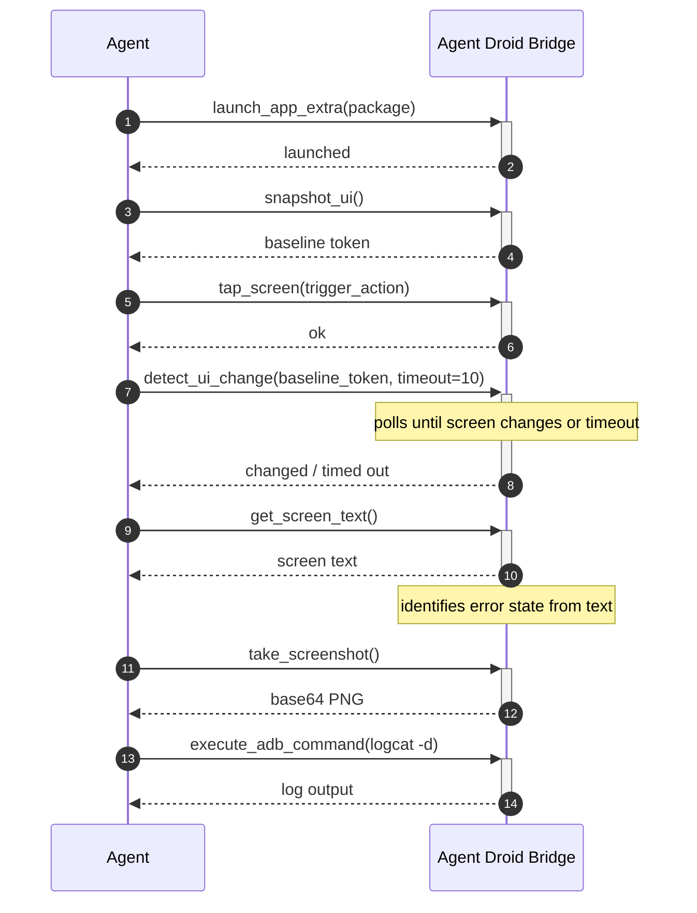
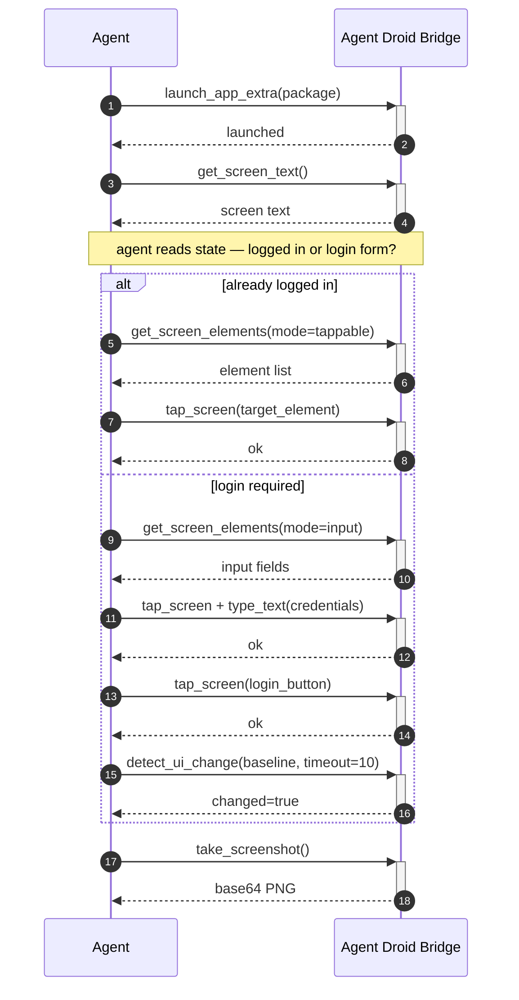
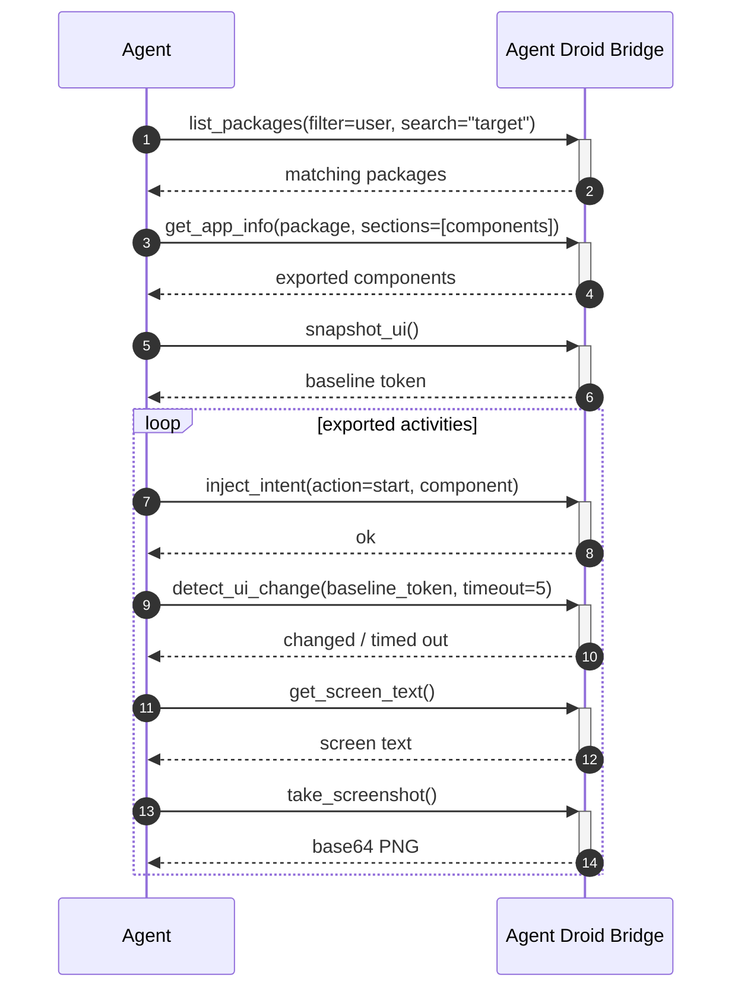

# Workflows

Common multi-tool patterns for automating Android interactions through the MCP server.

## App crash triage

When a build behaves unexpectedly, an agent can run the full diagnostic loop without human intervention. This workflow launches the app, establishes a UI baseline, triggers the action that is known to fail, detects whether the screen changed or froze, reads the resulting state, captures a screenshot for the record, and pulls the device log for offline analysis.

`detect_ui_change` returning `timed out` is itself diagnostic — it means the app froze or the expected transition never happened. The agent can branch on this result without any additional tooling.

Requires the `app_manager` pack for `launch_app_extra`.

## UI state-aware automation

A robust agent does not assume the app is in a known state before acting. This workflow reads the current screen first, decides what state the app is in, and takes the appropriate path — skipping steps that are already done and handling unexpected states without failing.

`get_screen_text` is cheap — it reads text already present in the UI hierarchy without any extra ADB round-trip. Reading state before acting prevents the agent from re-entering credentials on an already-authenticated session or tapping the wrong element.

Requires the `app_manager` pack for `launch_app_extra`.

## Exported component discovery and probing

Static analysis alone does not reveal how an app responds to unexpected input. This workflow retrieves an app's exported components, fires an intent at one of them, captures the resulting screen state, and records the response. The full loop — enumerate, probe, observe — runs in a single agent session with no instrumentation required.

`detect_ui_change` after each intent shows whether the component responded — a screen transition is evidence of a live, reachable entry point. A timeout suggests the component exists but did not produce a visible UI change, which is equally useful to record.

Requires the `app_manager` pack.
